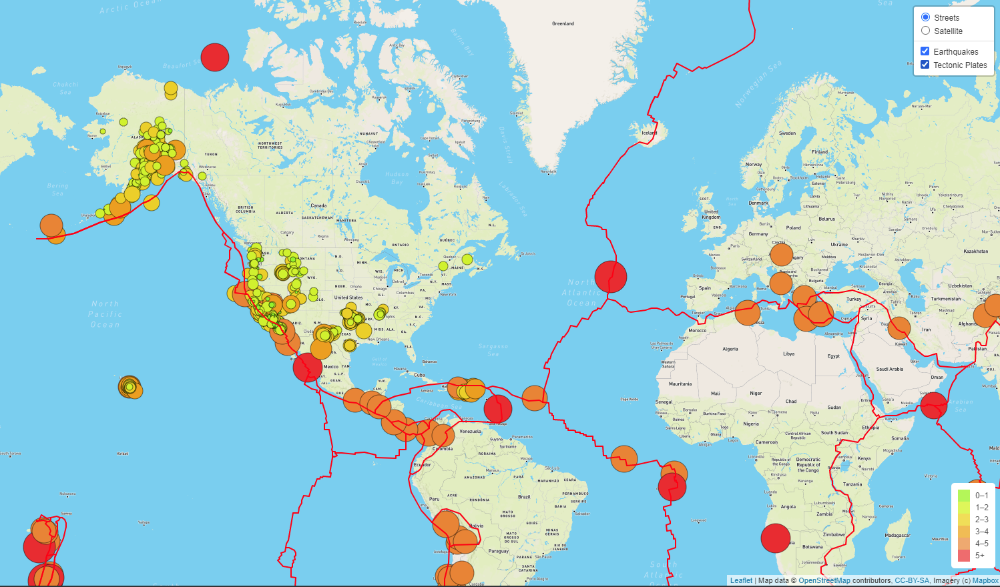
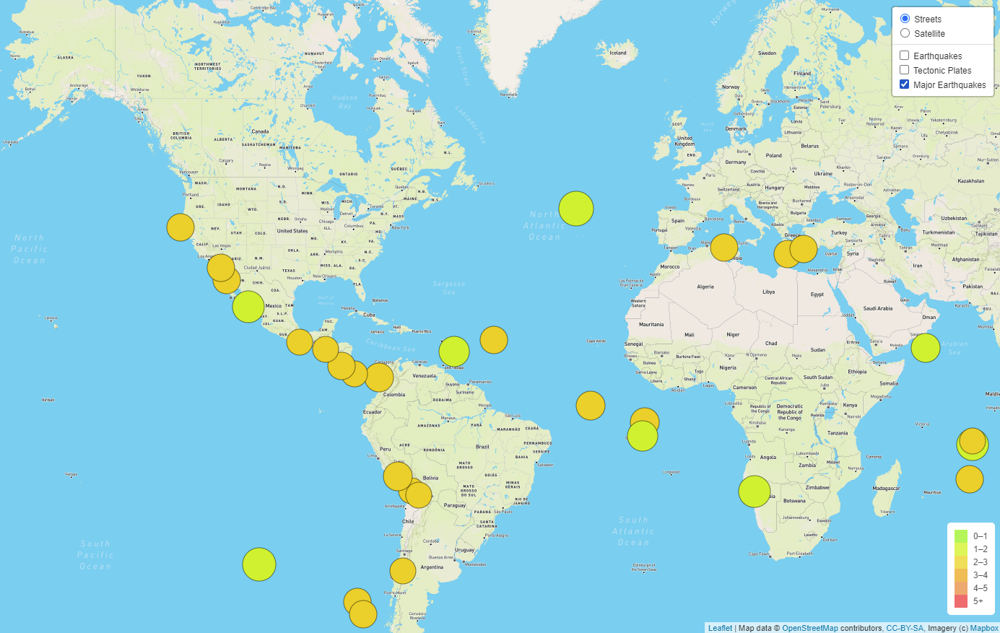
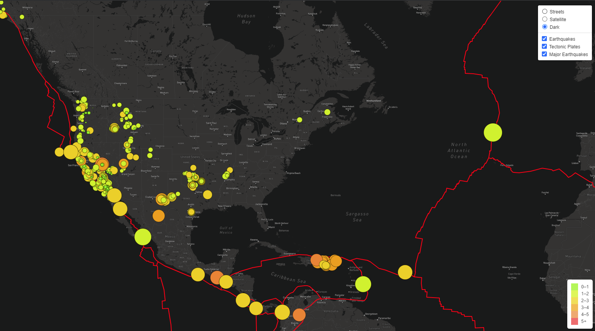

# Mapping Earthquakes with GeoJSON
This repo contains several iterations of a site that displays an interactive earthquake map. The most complete can be found in the Earthquake_Challenge folder.

Below, I have screencaptured each of the three deliverables from that folder:

Deliverable 1 - Overlaying tectonic plate data:

Deliverable 2 - Toggling datapoints for severe quakes, colored by severity:
* Note: Colors are working, but differences between them are minor

Deliverable 3 - Three changable base map layers:

